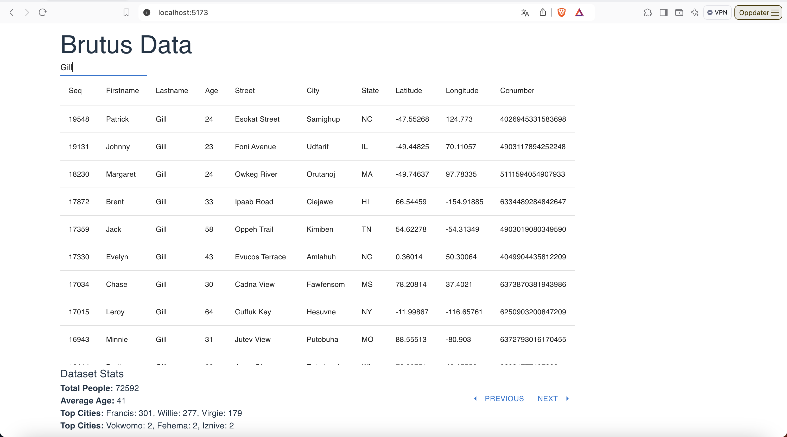

# Brutus

The project consists of two main parts: `brutus-app` and `brutus-service`.

The brutus service is an http server that enables users to upload and display data about people. To create people one can make a POST request with json-data (/person) or POST a csv-file (/people).

The service also has two GET endpoints:
GET /person is a paginated query towards the full dataset of people stored in the service. This endpoint also offers a simple search functionality for users to look for specific rows.

GET /person-stats:
Retrieves very simple data about the dataset. total count and the three most common cities



## Brutus App

`brutus-app` is a React application built with TypeScript and Vite.

### Installation

1. Navigate to the `brutus-app` directory:

   ```sh
   cd brutus-app
   ```

2. Install the dependencies:

   ```sh
   npm install
   ```

### Development

The following environment variables are needed to run the service

VITE_API_BASE=http://localhost:3000

To start the development server with hot module replacement:

```sh
npm run dev
```

## Brutus service

`Brutus-service` is an express.js node.js service written in typescript

### Installation

1. Navigate to the `brutus-service` directory:

   ```sh
   cd brutus-service
   ```

2. Install the dependencies:

   ```sh
   npm install
   ```

### Development

The following environment variables are needed to run the service

MONGO_CONNECTION_STRING=mongodb+srv://<user>:<password>@<cluster-url>/?retryWrites=true&w=majority&appName=<cluster-name>
ENV=development
HOST=localhost:3000

To start the development server:

```sh
npm run start
```
